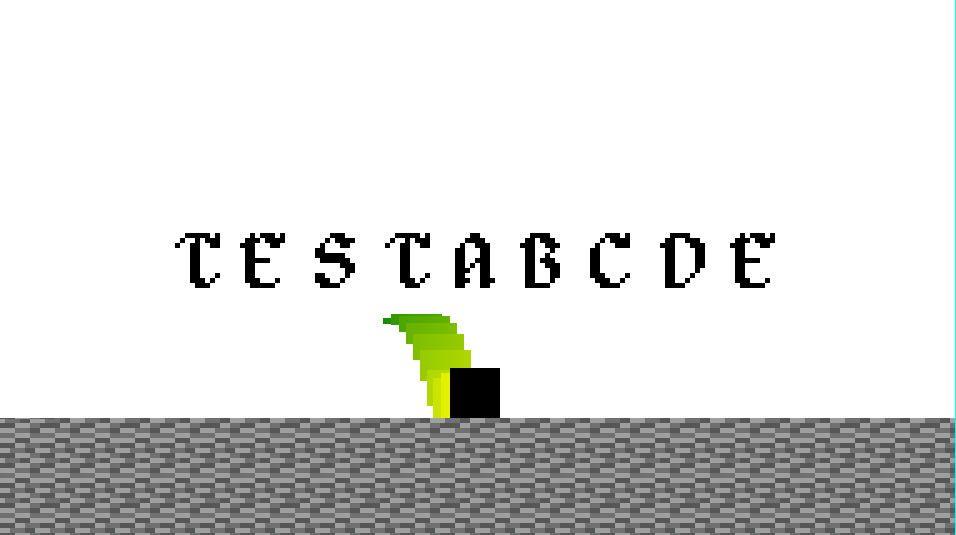

  # SDL GAME PROJECT
 

  ## About

  cool game

  ## Setup build enviroment 

  Install the necessary libs:
  - Install sdl2 lib
    On debian: `sudo apt install libsdl2-dev`
  
  ## Build and Run

  Build the project with: ./build.sh
  Run the game with: ./run.sh
